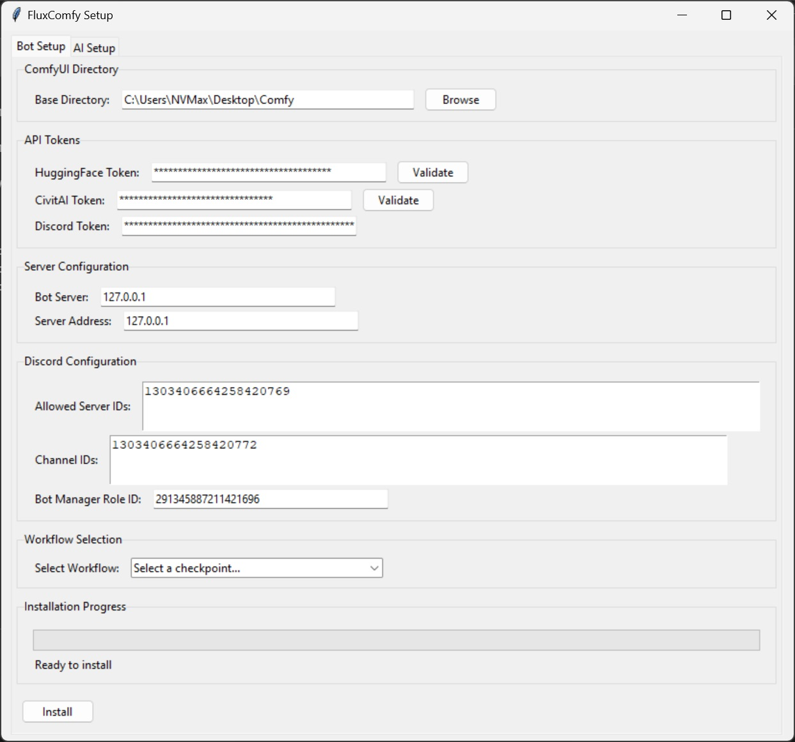
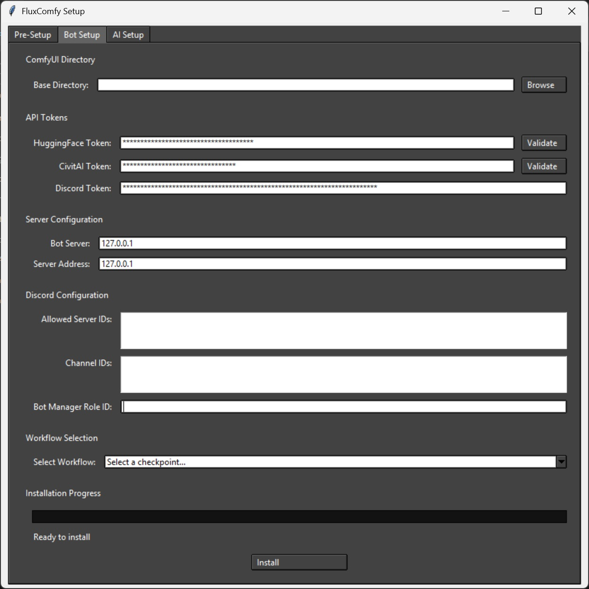
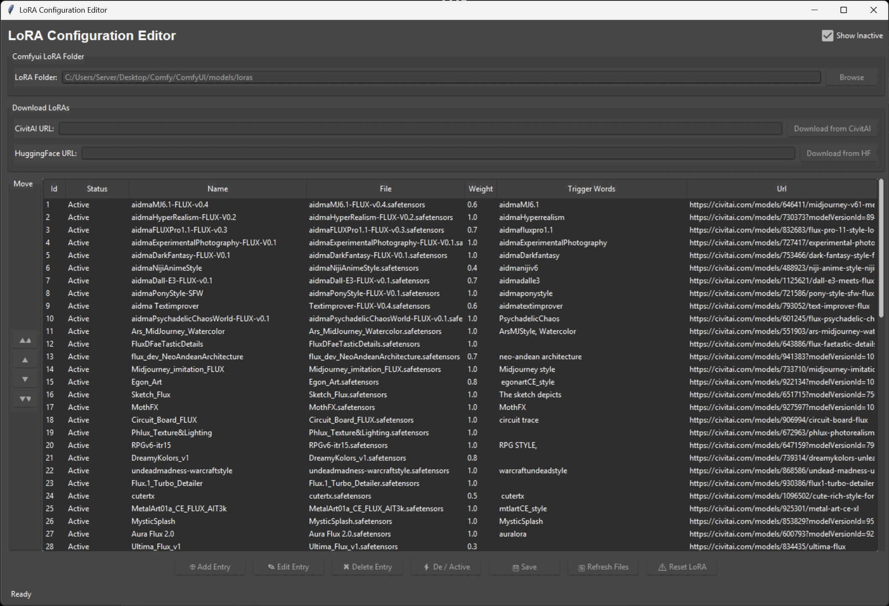

# ⚙️ Configuration Guide

## 🐳 Docker Installation

### Prerequisites
- Complete the standard installation and setup first
- Configure your LoRAs using the Lora_editor tool
- Docker and Docker desktop installed on your system


### 🤖 Discord Bot Setup

#### 1️⃣ Creating Your Discord Application
1. Visit the [Discord Developer Portal](https://discord.com/developers/applications)
2. Create New Application:
   - Click "New Application"
   - Name your bot
   - Navigate to "Bot" tab
   - Click "Add Bot"

#### 2️⃣ Bot Configuration
1. **Essential Bot Settings**
   - Copy Bot Token (keep secure!)
   - Enable Required Intents:
     ✓ Presence Intent
     ✓ Server Members Intent
     ✓ Message Content Intent

2. **Bot Permissions Setup**
   - Go to "OAuth2" tab
   - Select "bot" under Scopes
   - Required Permissions:
     ```
     ✓ Send Messages
     ✓ Manage Messages
     ✓ Embed Links
     ✓ Attach Files
     ✓ Read Message History
     ✓ Use Slash Commands
     ```
3. **Server Integration**
   - Copy OAuth2 URL
   - Open in new tab
   - Select target server

### 🛠️ Bot Configuration

#### Initial Setup
1. Create `.env` file in root directory add:
   ```env
   COMMAND_PREFIX=/
   ```

2. Run Setup Tool:
   ```bash
   python setup.py
   ```

<div align="center">
  
  
  
</div>

#### 📝 Configuration Details

1. **Path Configuration**
   - Browse to ComfyUI installation location
   - Example: `C:/Comfyui_windows_portable/` or your path

2. **API Tokens**
   - **Civitai Token:**
     1. Create account on [Civitai](https://civitai.com)
     2. Profile → Settings → Add API Key
   
   - **Huggingface Token:**
     1. Create account on [Huggingface](https://huggingface.co)
     2. Profile → Access Tokens
     3. Create token with "read access to public gated repos"

3. **Server Configuration**
   - Bot Server Address: Usually `127.0.0.1` (try `0.0.0.0` or `localhost` if needed)
   - ComfyUI Server: Same as bot (use remote IP if on different machine)

4. **Discord Settings**
   - Server IDs: Right-click server → Copy ID (e.g., `123456789,987654321,654321987`)
   - Channel IDs: Right-click channel → Copy ID (e.g., `123456789,987654321,654321987`)
   - Multiple IDs: Use comma separation (e.g., `123456789,987654321`)
   - BOT_MANAGER_ROLE_ID (optional): For bot administration
     - This role is not required for the bot to work. It's an optional configuration that provides an additional
      way to grant certain users bot management permissions without giving them full Discord admin rights.    
      If you don't set it, the bot will still function normally - only Discord administrators will be able to use the administrative commands.

5. **Model Selection**
   - Choose checkpoint based on GPU VRAM:
     - Support for 6GB to 24GB cards
     - Select version matching your VRAM capacity

### 🔧 Advanced Setup


#### ⚠️ Important Notes
- Required files will be automatically moved to their respective folders
- Checkpoint changes: Simply rerun setup tool
- Model changes require bot restart


### Docker Support

- Coming soon


## 🎨 LoRA Models Configuration

### 🌟 Introduction to LoRA Models
LoRA (Low-Rank Adaptation) models are the secret sauce that brings magic to your image generations! These models can:
- Enhance image quality
- Apply specific artistic styles
- Add unique characteristics to generations
- Transform your prompts into stunning visuals

### 📥 Getting LoRA Models manually
1. Visit [Civitai.com/models](https://civitai.com/models)
2. Apply filters:
   - Model Type: `LoRA`
   - Base Model: `Flux.1s` and `Flux.1 D`
3. Download your chosen models
4. Place files in: `comfyui/models/Lora` folder

### 🛠️ LoRA Editor Tool
Navagate to lor_editor folder and run:
```bash
python lora_editor.py
```

<div align="center">
  
</div>

#### ✨ Latest Updates
- 🔗 URL links support for `/lorainfo` command
- 🚀 Support for 600+ LoRAs
- 💾 SQLite3 database for persistent storage
- 🎯 Persistent trigger words
- 🤗 Huggingface support
- 🤗  Civitai support
- 🔄 Reset All Loras 
- ⚡ Instant LoRA availability
- 📋 Lora arrangement abilities


#### 🎯 Key Features
- 🔄 Auto-download LoRAs from URLs
- 🎯 Automatic trigger word population
- ⚖️ Pre-configured weights (default: 1.0)
    -if lora weight is less than 1, keep it do not change
- 📊 Easy weight customization
- 📋 Flexible list organization
- 🔗 Activate and deactivate loras 


### 📝 Manual Configuration
If you prefer manual setup, edit `Datasets/lora.json`:

```json
{
  "name": "Your LoRA Name",
  "add_prompt": "required_trigger_word",
  "file": "MyLoRA.safetensors",
  "weight": 1.0,
  "url": "https://civitai.com/api/download/models/123456789/MyLoRA.safetensors"
}
```

### 💡 Best Practices
1. **Weight Management**
   - Default: 1.0
   - Adjust lower for subtle effects
   - Test different values for optimal results

2. **Organization**
   - Use descriptive names
   - Editing the trigger words may result in loras not working
   - URL is auto populated.


### 🔍 Troubleshooting
- Verify file extensions (.safetensors)
- Confirm trigger words
- Test API connectivity

## 🔧 Bot Configuration

### Environment Variables
All environment variables are auto created when setup is ran

### Server Configuration
1. Enable `--listen` on ComfyUI server
2. Configure port settings (default: 8188)
3. Set up SSL if needed (recommended for production)
