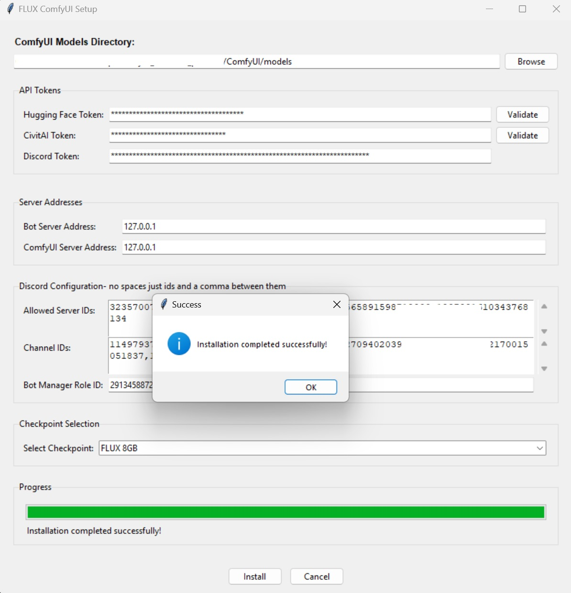
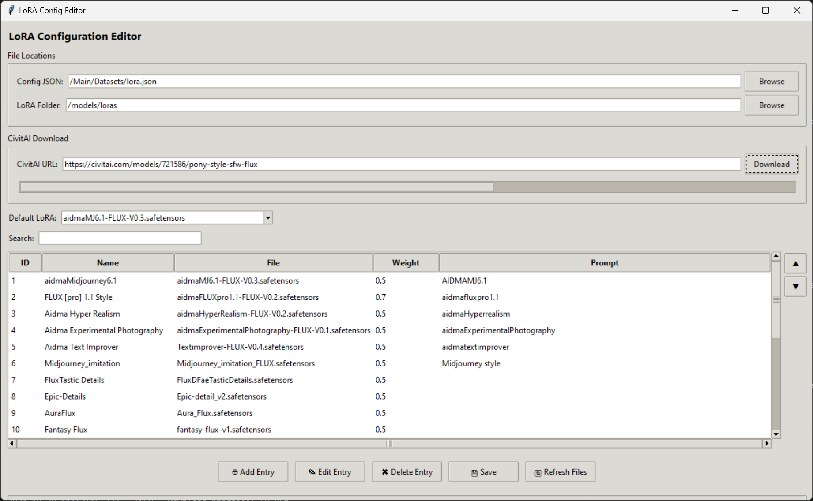



<p align="center">
  
</p>

Welcome to the world of AI-powered imagination with My Comfyui Discord Bot! This fantastic bot is your gateway to transforming text into stunning visuals, bringing your wildest ideas to life with just a few keystrokes, and share with your friends in discord.  

Imagine a digital artist that never sleeps, always ready to paint your dreams and fantasies. That's exactly what this bot offers! With the power of advanced AI, it can generate images from your text prompts, allowing you to explore visual concepts you might never have thought possible.

But it doesn't stop at simple text-to-image conversion. This bot comes equipped with a variety of options to fine-tune your creations:  

- Choose from different resolutions to get the perfect size for your needs.

- Apply LoRA (Low-Rank Adaptation) models to infuse specific styles or characteristics into your images.

- Adjust upscaling factors to increase resolution for larger image generations. 

  

Whether you're an artist looking for inspiration, a writer wanting to visualize your scenes, or just someone who loves to explore the boundaries of creativity, this bot is your perfect companion. It's designed to make the process of AI image generation accessible, fun, and endlessly fascinating, and shareable with your friends in discord.

  

So, are you ready to dive into a world where your words paint pictures? Where your imagination knows no bounds? Where you can create images you never even knew you could think of? Then you're in the right place! Let's embark on this exciting journey of AI-powered creativity together!

## New Updates:
  * 11/12/2024
  * Compiled the setup tool for windows, now run the Setup.exe to install the bot.


  * 11/11/2024
  * New comfyui installs were giving errors loading the workflow due to changes in "numpy 2" support.
  * Setup tool now copies over a modified file for this bot to work with "numpy 2" (does not break numpy 2 in any newer nodes, only fixes older nodes using less than 2.0 version)
  * Updated setup tool with folder validation specify your base directory of Comfyui Example: C:/Comfyui_windows_portable/ComfyUI should contain the comfyui launcher in it.
  * Updated code for Lora_monitor resolves issues with timing of updating lora list with in the bot, better verification of update status.


  * 11/9/2024
  * Now Supports Docker - refer to "Setting up the Discord Bot" for more details
  * Fixed issue with lora "confirm selection" button not updating the amount of loras selected.
  * Loras are now monitored and when a new one is detected it will be added to the list of loras on the bot, no need to restart the bot(does not apply to Docker ran installation).
  * Lora list now supports more than 25 loras, theoritically it can support north of 600 loras.
  * Lora editor
    * Added active and inactive status, you can now select what ones you want to show with out having to delete them.
    * Added Jump 5 space buttons, will move the selected lora up or down 5 spaces
    * Added reset lora this will wipe out all loras(destructive) does not delete your loras in your folder.
    * Added Huggingface support, you can now download loras from huggingface.

## Table of Contents
1. [Prerequisite](#prerequisite)
2. [Installation](#installation)
3. [Setting up the Discord Bot](#setting-up-the-discord-bot)
4. [Configuring the Bot](#configuring-the-bot)
5. [Getting Started](#getting-started)
6. [Troubleshooting](#troubleshooting)
7. [Contributing](#contributing)
8. [License](#license)


    ### prerequisite 
    1. [Comfyui](https://github.com/comfyanonymous/ComfyUI) please install and configure for use.
    - Please enable --listen on your comfyui server. 
    2. Launch Comfyui and load workflow.json from required_files and install missing nodes.
      - if you are new or new installation please download [comfyui manager](https://github.com/ltdrdata/ComfyUI-Manager) before loading this workflow

## Installation   

1. Clone the repository or download the source code to your local machine. 

2. Ensure you have Python 3.x installed on your system. You can download it from [python.org](https://www.python.org/downloads/). 

3. Open a terminal or command prompt and navigate to the directory containing the bot files. 

4. Install the required dependencies using the requirements.txt file: 
 ```pip install -r requirements.txt```

This command will install all the necessary libraries for the bot to function. 

5. Follow the configuration steps outlined in the [Setting up the Discord Bot](#Setting-up-the-Discord-Bot) section.

6. Once everything is configured, you can run the bot using: 
``` Python bot.py```
 

The bot should now be running and connected to your Discord server. 

Note: If you close the terminal, it ends the bot. 


## Setting up the Discord Bot

  

1. Go to the [Discord Developer Portal](https://discord.com/developers/applications). 

 * Click on "New Application" and give your bot a name. 
 * Once created, go to the "Bot" tab in the left sidebar. 
 * Click "Add Bot" to create a bot user for your application.
 * Under the bot's username, you'll see a "Token" section. Click "Copy" to copy your bot token. Keep this token secret and secure.
 * click Bot on the left side, In the "Privileged Gateway Intents" section, enable the following intents:
   * Presence Intent
   * Server Members Intent
   * Message Content Intent
* Go to the "OAuth2" tab in the left sidebar.
* In the "Scopes" section, select "bot".
* In the "Bot Permissions" section, select the permissions your bot needs. At minimum, it will need:- 
	* Send Messages
  * Manage Messages
	* Embed Links
	* Attach Files
	* Read Message History
	* Use Slash Commands

2. Copy the generated OAuth2 URL at the bottom of the "Scopes" section. 

3. Open a new browser tab, paste the URL, and select the server where you want to add the bot.


## Configuring the Bot
1. Create a new .env in the root directory of the bot
2. add "COMMAND_PREFIX=/" with out the quotes of course this is all you need in your .env file.
3. run setup.py from cmd window, Or run the Setup.exe from the root directory.
4. fill in your information.
  - click browse and select the location of your comfyui models folder.  Example: C:/Comfyui_windows_portable/ComfyUI/models
  - populate your huggingface, Civitai, and Discord tokens
  - Civitai create an account on Civitai and click on your profile picture on the top right and click settings, scroll all the way down to the bottom and click add API key
  - Hugginface create an account, click on your icon top right corner, click Access Tokens, create a new token and select "read access to contents of all public gated repos you can access" click save and copy your token.
  - Bot server addresss is the address your bot is running on typically 127.0.0.1 if that doesnt work try 0.0.0.0 or localhost.
  - Comfyui Server Address is the address comfyui is running on again probably the same as your bot, if you use a seperate machine then enter that ip, (yes this can work over the internet, not recommended for timing and slowness reasons).
  -alloed Server ID's is the server ids of the discord server you are running it on, right click on server and click copy server id, if you dont have this option turn on developer mode in settings. 
  Channel ID's, right click with the channel you want the bot to work in and copy channel id and paste it in here.
  if you have multple servers and channels just enter with a comma no spaces example: 123456789,987654321
  - Bot Manger Role ID: this is if you want to give a friend or someone control over the bot on discord, this is not discord admin this is just bot admin. if you dont just leave this blank or put your own in it. 
  - Checkpoint selection: 
  - various checkpoints that support multiple new cards it is listed on them, now can support 6,8,10,12-16 and 24GB cards please select the version that best suits your cards VRAM.

  All files needed to run flux will download if they are not found with in your comfyui installation.
  
  * at any point you want to change the checkpoint just run the setup tool again and select the new model you want that easy.
  * if its already downloaded it will not download again it will just change your .env variable to support the change (reboot bot)


    
    
  

  ## Docker Installation:
   * requires previous setup to be completed first
   * configure your loras file using the Lora_editor tool
   * run the following command in your terminal:
   ```
   docker-compose up --build
   ```
   * if it doesnt link up to your comfyui you may need to adjust the server adddress in the dockerfile
   * Line 33, ENV server_address=0.0.0.0 (try 127.0.0.1 or your actual internal ip on your network, or ip where comfyui is running)
   * after build you dont need to run the build command again just run 
   ```
   docker-compose up
   ```

	 
## LoRA (Low-Rank Adaptation) models Config

This is where the magic happens, LoRA models can enhance and apply a specific feeling or desired result to a image,  You can download various lora's from [Civitai.com/models](https://civitai.com/models) use the filter options and select LoRA under Model types, and select Flux.1s and Flux.1 D under Base model this will sort the models that you can use with this bot.

These models will go in your comfyui/models/Lora folder.

## Adding LoRA's to your bot 
(please configure this before running, has examples already you may not have!)

### New Tool: Lora_editor

    ### update: 
    * Now supports more than 25 LoRA's, theoritically it can support north of 600 LoRA's.
    * You can activate and deactivate loras from the gui. 
    * Persistant lora information is stored in sqlite3 database.
    * Trigger words are now persistant. 
    * Now supports Huggingface (you will need to add the trigger words yourself for HF LoRA's)
    * Now has a reset lora button, this will wipe all loras from the list. (will not delete the lora files)
    * has 5 space jump for listed loras, double arrows will jump the item in list 5 spaces up or down.
    * Loras are now instantly available on the bot as soon as they are added to the list. 

  * This tool will allow you to configure your LoRA's with a simple gui, it will also allow you to download new LoRA's from Civitai and Huggingface.
  * Open lora_editor.py  using "python lora_editor.py", it will open a gui window.
  * Select the LORA_JSON_PATH to the lora.json file in the datasets folder.
  * Select the LORA_FOLDER_PATH to the lora folder in your comfyui models folder.
  * populate your civitai and huggingface tokens.
  * Click refresh lora files to load in any new loras you have added.
  * Select a LoRA from the list and edit the weight, this will take effect once the bot is restarted.
  * You can also add new LoRA's from Civitai by clicking the add LoRA button and pasting the full civitai url of the lora you want to download.
  * Civitai API token is required to download from Civitai, you can get one for free by creating an account on Civitai and clicking on your profile picture on the top right and click settings, scroll all the way down to the bottom and click add API key, copy and paste the API key into the CIVITAI_API_TOKEN field in the .env file.  (yes you will need your token here too seperate tool)

  Benifits of using tool:
  - it autodownloads the lora's by pasting in the URL to the lora
  - it auto populates trigger words required for the lora to work
  - no fuss easy and simple to use, weights are already set to 0.5 (for multiple loras this is HIGHLY recommended)
  - for loras requiring less than 0.5 please change it to the lower option.
  - allows you to customize in what order they are shown in the bot easily.
      

  
  #### Manually configure:
  * open the lora.json file located in /Datasets 
  * Add name of your LoRA you downloaded or use a name you choose so you know what it is, this does not need to be the actual name of the file.
  * add_prompt: if the lora requires a trigger word place it in this field
  * file: this is the exact name of the LoRA file with .safetensors, Example: MyLoRA.safetensors
  * weight: this is the weight required to get the desired effect from the lora.  
    * 0.5 is ideal if you are wanting to use multiple LoRA's at one time, having many at 1.0 can cause mass hallucination on image generations.
   
    
    
    


#### Banned words or people

1. Banned users and banned words are handled in the database.
    * you will need to add banned words to this list using the /add_banned_word command, by default it is empty. 

* Admin or Bot Manager can review, unban or even ask it why using the slash commands in discord
	 * /add_banned_word "word"
	 * /ban_user "discord id"
	 * /list_banned_users  - lists all that have been banned (should display the discord name)
	 * /list_banned_words - lists all banned words currently checking for
	 * /remove_banned_word - removes specified word
	 * /unban_user "discord id"
	 * /whybanned "discord id" - gives reason why this person was banned and the prompt they tried to use. 
     * /reboot - reboots the bot, this is useful if you are having issues with the bot and need to restart it.

#### Update: The banned words was pretty harsh, 1 use and banned no warnings.
  * implemented a warning system, 2 warnings 3rd time banned.
  * will alert user to the banned words list in the message they recieve. 
  * admins can use /check_warnings and /remove_warning to remove or check.
  * this should also message admins about the warning as well. (not sure but should discord is funny)


<h3 id="requiredfiles" style="color: red; font-size: 24px;">REQUIRED FILES</h3>


Required Files folder, these are critical and needed to make sure the bot works right with the workflow and resolutions that flux can support.
1. workflow.json - after comfyui is installed load this workflow, install all needed nodes using its manager. 
 - this is the workflow for comfyui to use for image generations, the bot uses the api format of this file.
2. ratios.json - this is a edit of mikey_nodes to add more resolutions that his nodes did not have that flux supports, location  ```ComfyUI\custom_nodes\mikey_nodes```
3. 4x-ClearRealityV1.pth is for the CRUpscaling 
- the Setup.py/setup.exe will automatically download any checkpoints and copy over the ratios.json and 4x-ClearRealityv1 to required folders.


## Getting Started 
1. First things first, make sure you're in a channel where the bot is active. Your server admin will know which channels these are! 
2. To summon our artistic AI companion, you'll use the `/comfy` command. It's like saying "Hey, AI, let's make some art!"

#### Creating Your Masterpiece 
1. Type `/comfy` in the chat, and you'll see a menu pop up. This is where the magic begins! 
2.  In the "prompt" field, describe the image you want to create. Be as creative and detailed as you like! For example: "A steampunk cat piloting a flying teapot over a city of clockwork buildings" 
3. Choose your desired "resolution" from the dropdown menu. This determines the size and shape of your image. 
4. (Optional) Want your image extra large? Set an "upscale_factor" between 1 and 4
		* Higher numbers make the image larger it is a factor of scale 1024x1024x2 = 2048x2048. 
5. (Optional) Feeling lucky? Add a "seed" number for consistent results. Or leave it blank for a surprise each time! 
6. Hit enter, and watch the magic unfold!

#### Customizing with LoRAs 
After you send the command, the bot will ask you to choose LoRAs (Low-Rank Adaptations). 
These are like special artistic styles or themes. Select the ones you want to apply to your image. It's like choosing different brushes for a painting! 

#### Waiting for Your Art
 The bot will start generating your image. It might take a little while - great art takes time, after all! You'll see progress updates, so you know it's hard at work.
			 - when it starts there maybe a long pause before it starts showing generation, this is loading the Flux models and loras selected. speed is dependent on the machine its running on

#### Admiring and Adjusting 
Once your image appears, you have a few options:
		 - 📚 "Options": Want to tweak your creation? This lets you adjust the resolution, LoRAs, or prompt and generate a new version. 
		 - ♻️ "Regenerate": Love the idea but want to see a different take? This creates a new image with the same settings. 
		 - 🗑️ "Delete": Not quite what you were looking for? You can remove the image.

#### Tips for Great Results 
- Be specific in your prompts. Instead of "a cat", try "a fluffy orange tabby cat wearing a top hat and monocle". 
- Experiment with different LoRAs to find styles you love. 
- If you're not happy with the result, try regenerating or adjusting your prompt and options. 
- Remember, the AI is creative but not perfect. Sometimes unexpected results can lead to exciting new ideas! 

#### Have Fun! 
The most important rule is to have fun and let your imagination run wild! Every prompt is an adventure, and you never know what amazing images you might create. Happy generating!


## Troubleshooting 
Encountering issues? Don't worry! Here are some common problems and simple solutions to get you back to creating amazing images. 

### Hardware Requirements For the best experience, we recommend:
 -  CPU: Recent Intel or AMD processor 
 -  RAM: 64GB of system memory 
 -  GPU: NVIDIA RTX 3090 or 4090 
 - While lower specifications may work, you might experience slower performance or limitations in image size and quality. If you have lower-end hardware: - You may need to adjust settings in ComfyUI to work with lower memory GPUs. - Check the [ComfyUI documentation](https://github.com/comfyanonymous/ComfyUI) for optimizations for lower-end hardware. 

 ### UPDATE: Now supports lower Vram GPUS thanks to FluxFusion.
   - 6,8,10,12-16, 24 all supported, use Setup tool and select the checkpoint for the size of your VRAM. 

### Common Issues 
1.  **Bot Not Responding** - Ensure the bot is online and has proper permissions in your Discord server. - Check if you're using the command in an allowed channel. 
2.  **Slow Image Generation** - This could be due to high server load or limited hardware resources. - Be patient, or try again at a less busy time. 
3.  **Error Messages** - If you see specific error messages, try restarting the bot. - Check the bot's console output for more detailed error information, you may also join discord and ask for help.
4.  **Installation Problems** - Ensure you have Python 3.x installed correctly. - Verify that all dependencies are installed using `pip install -r requirements.txt`. 
5.  **GPU Not Detected** - Make sure you have the latest NVIDIA drivers installed. - Confirm that your GPU is CUDA-compatible and properly recognized by your system. 
6.  **Out of Memory Errors** - Try generating smaller images or using fewer LoRAs. - Close other resource-intensive applications on your system. 

### Still Having Trouble? If you're still experiencing issues: 
- Double-check all configuration settings by running the Setup.py or setup.exe.  
- Consult the ComfyUI documentation for advanced troubleshooting specific to the image generation backend.
		- There are options to use lowvram for comfyui this may allow it to work on 4070's 4060's and AMD GPUs with less that 24GB of VRam, even if you are running fluxfusion checkpoints. 

Remember, running AI image generation can be resource-intensive. If you're consistently having issues, you might need to consider upgrading your hardware or optimizing your setup. For further assistance, don't hesitate to reach out. 

## Upcoming Features:
 Always open to suggestions, please open an issue in the github repository, or reach out to me on discord. 

## Contributing 
We welcome contributions to improve and expand this Discord Image Generation Bot! If you're interested in contributing, please follow these guidelines: 
1. Fork the repository and create your branch from `main`.
2. Make your changes, ensuring they adhere to the existing code style. 
3. Test your changes thoroughly. 
4. Create a pull request with a clear description of your improvements. For major changes or new features, please open an issue first to discuss what you would like to change. This ensures your time is well spent and your contributions align with the project's direction. 

If you encounter any bugs or have feature suggestions, please open an issue in the GitHub repository. For any questions or further information about contributing, please contact: Jerrod Linderman Email: nvmaxx@gmail.com We appreciate your interest in making this bot even better!

## License This project is dual-licensed: 
1. For non-commercial use, this software is licensed under the MIT License (see below). 
2. For commercial use, please contact Jerrod Linderman at nvmaxx@gmail.com to obtain a commercial license. 


## License 
Copyright (c) [2024] Jerrod Linderman 

This software is provided under a dual license model designed to meet the needs of both non-commercial and commercial users. 

### Non-Commercial Use License Permission is hereby granted, free of charge, to any person obtaining a copy of this software and associated documentation files (the "Comfyui Discord Bot"), to use, copy, modify, merge, publish, and distribute the Software for non-commercial purposes only, subject to the following conditions: 
1. The above copyright notice and this permission notice shall be included in all copies or substantial portions of the Software. 
2. The Software may not be used for commercial purposes, including but not limited to: - Selling the Software or derivatives of it - Using the Software to provide paid services - Incorporating the Software into a product that generates revenue 
3. Redistributions of the Software must retain this license notice and may not alter the terms for further redistribution. 

THE SOFTWARE IS PROVIDED "AS IS", WITHOUT WARRANTY OF ANY KIND, EXPRESS OR IMPLIED, INCLUDING BUT NOT LIMITED TO THE WARRANTIES OF MERCHANTABILITY, FITNESS FOR A PARTICULAR PURPOSE AND NONINFRINGEMENT. IN NO EVENT SHALL THE AUTHORS OR COPYRIGHT HOLDERS BE LIABLE FOR ANY CLAIM, DAMAGES OR OTHER LIABILITY, WHETHER IN AN ACTION OF CONTRACT, TORT OR OTHERWISE, ARISING FROM, OUT OF OR IN CONNECTION WITH THE SOFTWARE OR THE USE OR OTHER DEALINGS IN THE SOFTWARE.

### Commercial Use 

For any commercial use of this Software, including but not limited to selling the Software, using it to provide paid services, or incorporating it into revenue-generating products, please contact Jerrod Linderman at nvmaxx@gmail.com to obtain a separate commercial license. By using this Software, you agree to abide by the terms of this licensing arrangement. Unauthorized commercial use of this Software is strictly prohibited and may result in legal action.

